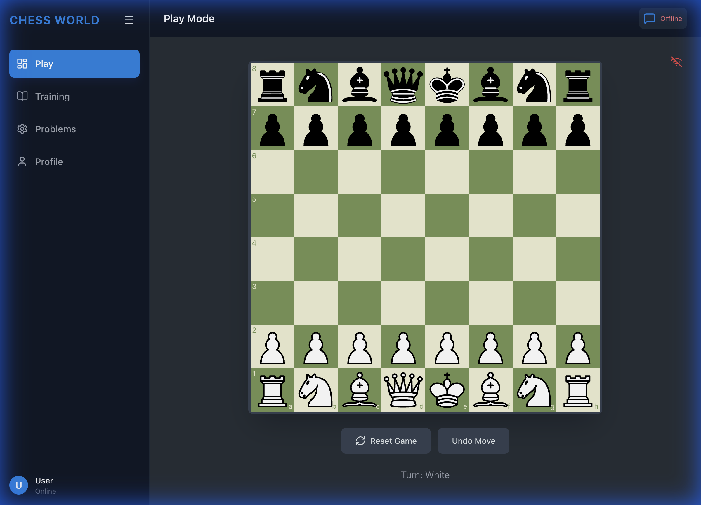

# Chess World

- **PGN Loading**: Upload your own PGN files (or use our examples like `CatalanClosed.pgn`) to analyze specific games or openings.
- **Legal Move Highlighting**: Drag a piece to see all possible legal moves, helping you learn piece movement and avoid blunders.
- **Evaluation Bar**: Visual feedback on who is winning (Positive for White, Negative for Black).


A modern, full-featured chess application built with React, Python (FastAPI), and AI integration.



## Features

- **Play Mode**: Interactive chessboard with real-time rule enforcement and multiplayer support
  - **Multiplayer Game Sharing**: Share games via URL with unique Game IDs
  - **Real-time Synchronization**: All players in the same game see moves instantly
- **Training Mode**: Load PGNs, analyze with Stockfish, and step through games
- **Problems Mode**: Solve chess puzzles fetched from Lichess
  - **Hint System**: Get visual hints showing which pieces to move
  - **Random Puzzles**: Fetch different puzzles from a curated collection
  - **Adaptive Board Orientation**: Board stays oriented from solver's perspective
- **AI Assistant**: Chat with a local LLM (Ollama) for position analysis
  - **Screenshot Preview**: Capture board positions and preview before sending
  - **Context-Aware Analysis**: Assistant understands current board state
- **Authentication**: Secure login/signup system with session persistence
  - **Protected Features**: Training, Problems, and Profile require authentication
  - **User Profiles**: Track ELO and game statistics
- **Profile**: Track your stats and progress

[Detailed Feature Explanation](features_explained.md) | [Future Suggestions](suggestions.md)


---

## 🔧 Backend Implementation

The backend is built with **Python (FastAPI)** and serves as the central nervous system of the application.

### **1. API Structure (`main.py`)**
- **FastAPI**: We chose FastAPI for its speed and automatic documentation.
- **Endpoints**:
    - `GET /`: Health check.
    - `GET /users/{username}`: Fetches user profile data from the database.
    - `WS /ws/game`: The WebSocket endpoint for real-time game communication.

### **2. Real-time Communication (WebSockets)**
- We use FastAPI's `WebSocket` support to create a persistent connection between the client and server.
- **GameManager Class**: Manages active connections and the global game state. When a player makes a move, it is sent to the server, validated by `python-chess`, and then broadcast to all other connected clients.

### **3. Database (`database.py`)**
- **SQLAlchemy**: We use SQLAlchemy as the ORM (Object Relational Mapper) to interact with the database.
- **SQLite**: For development, we use a local SQLite file (`chess_world.db`).
- **User Model**: Defines the schema for storing user data (username, elo, stats).

### **4. Game Logic**
- **python-chess**: This powerful library handles all the heavy lifting for chess rules (move generation, validation, FEN parsing) on the server side, ensuring no illegal moves can be forced by a hacked client.

---

## 🚀 Deployment Guide

### **Frontend (GitHub Pages)**
1.  Build the project:
    ```bash
    cd frontend
    npm run build
    ```
2.  Deploy the `dist` folder to GitHub Pages (automated via GitHub Actions).

### **Backend (e.g., Render.com)**
1.  Create a new Web Service on Render.
2.  Connect this repository.
3.  Set Build Command: `pip install -r backend/requirements.txt`
4.  Set Start Command: `uvicorn backend.main:app --host 0.0.0.0 --port $PORT`

## 💻 Local Development

1.  **Backend**:
    ```bash
    python3 -m venv venv
    source venv/bin/activate
    pip install -r backend/requirements.txt
    uvicorn backend.main:app --reload
    ```

2.  **Frontend**:
    ```bash
    cd frontend
    npm install
    npm run dev
    ```

## 👥 Contributors

- **Google Antigravity** - *AI Co-pilot & Architect*
- **Daniele Buschi** - *Lead Developer*
