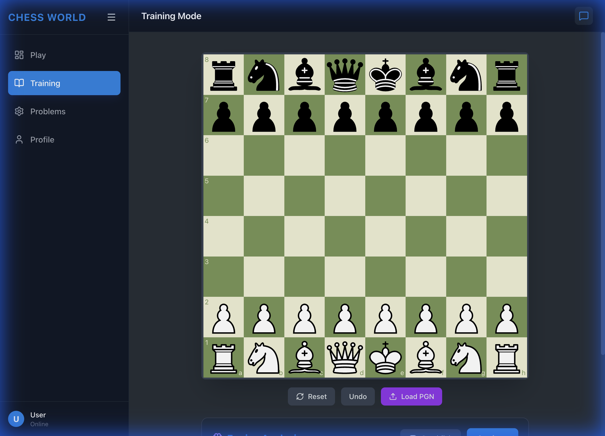
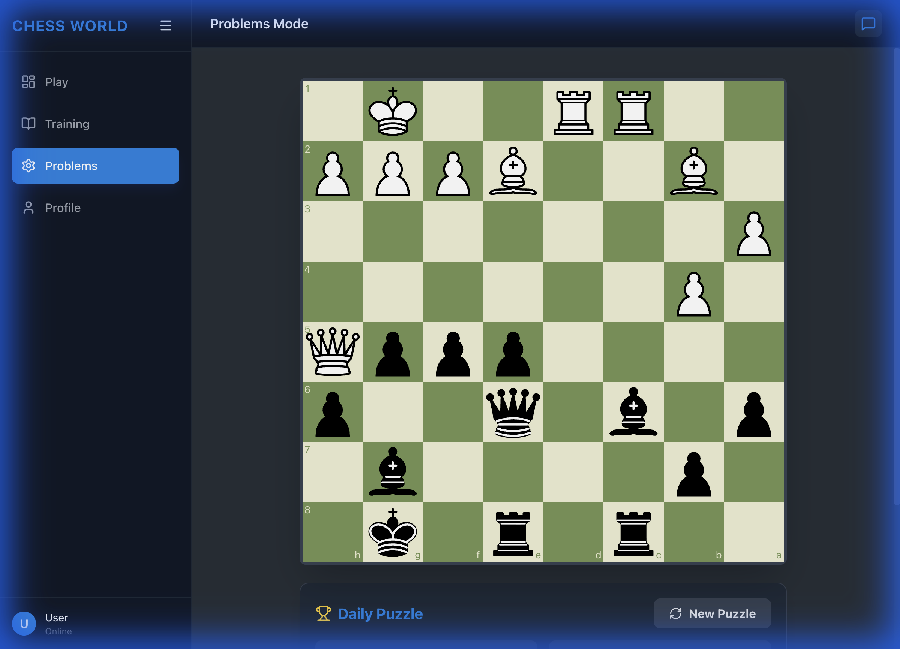

# Chess World - Features & Architecture

## 1. Architecture Overview

### Frontend
- **Framework**: React (Vite)
- **Styling**: Tailwind CSS + Lucide Icons
- **Chess Logic**: `chess.js` (Game state), `react-chessboard` (UI)
- **Communication**: WebSocket (`/ws/game`) for real-time moves, REST API for other data.

### Backend
- **Framework**: FastAPI (Python)
- **Chess Engine**: `python-chess` (Rule enforcement), Stockfish (Analysis)
- **AI/LLM**: Ollama integration (supports `gemma3:27b`, `llama3.2-vision`)
- **Database**: SQLite (`chess_world.db`) via SQLAlchemy

## 2. Key Features

### Interactive Chessboard

- **Real-time Updates**: Moves are sent to the backend via WebSocket. The backend validates the move using `python-chess` and broadcasts the new FEN.
- **Optimistic UI**: The frontend updates the board immediately for a responsive feel, but reverts if the backend rejects the move (e.g., illegal move).
- **Visual Feedback**: Legal moves are highlighted (if enabled), and check/checkmate states are displayed.
- **Multiplayer Game Rooms**: Each game has a unique Game ID allowing multiple players to join and play together
  - Games are managed server-side with WebSocket broadcasting
  - Share game URLs to invite friends
  - Real-time move synchronization across all connected players

### AI Assistant (Chat)
- **Integration**: Connects to a local Ollama instance.
- **Context Awareness**: The assistant knows the current board state (FEN) and can analyze positions.
- **Screenshot Preview Workflow**: 
  - Click "Screenshot" to capture the current board position
  - Preview appears above chat input with option to cancel
  - Type your question and send message + screenshot together
  - Provides more control over when and what to send
- **Multimodal**: Supports image analysis if a vision model is used.
- **Dynamic Model Selection**: Automatically detects available models (e.g., `gemma3:27b`) to ensure functionality without complex configuration.

### Training Mode

- **PGN Loading**: Parse and replay games from PGN files.
- **Engine Analysis**: Toggle between Stockfish (local) and external APIs for position evaluation.
- **Best Move Suggestions**: The engine suggests the best continuation.
- **Move Navigation**: Step forward/backward through game moves with dedicated controls

### Problems Mode

- **Puzzle API**: Fetches puzzles from Lichess/RapidAPI.
- **Interactive Solving**: Users make moves, and the system responds with the opponent's move.
- **Hint System**: Click "Show Hint" to see highlighted squares showing which piece to move (from/to squares)
  - From-square highlighted in bright yellow
  - To-square highlighted in lighter yellow
  - Hint disappears after 3 seconds
- **Random Puzzles**: "New Puzzle" button fetches from a curated pool of puzzle IDs
  - Ensures variety instead of always showing the daily puzzle
  - Cycles through different difficulty levels and tactical themes
- **Adaptive Orientation**: Board always displays from the solver's perspective
  - Automatically detects which color you're playing from the puzzle FEN
  - Maintains orientation throughout the puzzle solution

### Authentication System
- **Secure Backend**: JWT-based authentication with password hashing (bcrypt)
- **Database Integration**: SQLite database stores user credentials and profiles
- **Session Persistence**: LocalStorage maintains login state across page reloads
- **Access Control**: 
  - Play mode: Available to all users
  - Training, Problems, Profile: Require authentication
  - Visual indicators (🔒) show locked features
  - Login prompt appears when accessing restricted features
- **User Management**:
  - Sign up with username, email, and password
  - Login with username and password
  - User profile displays username and ELO rating
  - Logout functionality clears session

## 3. Data Flow

1.  **Move Made**: User drags piece -> `makeMove` (Frontend)
2.  **Validation (Local)**: `chess.js` checks basic legality.
3.  **Transmission**: UCI move (e.g., "e2e4") sent via WebSocket.
4.  **Validation (Server)**: `python-chess` enforces strict rules (checks, pins, etc.).
5.  **Update**:
    - **Valid**: Server updates board, sends new FEN. Frontend confirms.
    - **Invalid**: Server sends "error". Frontend reverts board.

## 4. Deployment
- **Frontend**: Ready for GitHub Pages (build with `npm run build`).
- **Backend**: Python-based, requires `uvicorn` and `stockfish` (optional).
